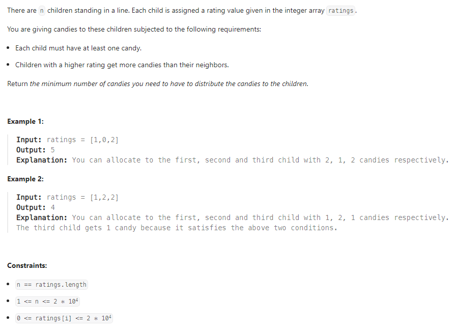

# Problem Description

# Approach
## Step 1:
n = ratings.size(); - as per problem description number of children = the size of the ratings array.
    
if(n <= 1) return n; - if there only 1 child or none i.e. n = 0 or 1, we simply return n;

Each child must have at least one candy. Therefore, it we can assume that the starting value of result (the return value for the number of total number of candies) can be n = ratings.size().
## Step 2:
    
## Step 3:
